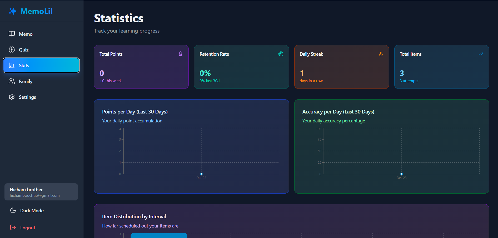

# ✨ MemoLil - Smart Learning App

A beautiful, production-ready React app with **golden yellow theme** and **AI-powered question generation** using Claude/OpenAI!




## 🎨 New Design Features

- **Beautiful Golden Yellow Theme** - Warm amber and golden colors throughout
- **AI-Powered Questions** - Uses Anthropic Claude or OpenAI to generate high-quality questions
- **Gradient Accents** - Stunning amber-to-orange gradients on key elements
- **Premium Feel** - Enhanced visual appeal with golden highlights

## Features

### 📝 Knowledge Capture (Memo)
- Create knowledge snippets with title, content, tags, and difficulty
- **AI-Powered Question Generation** using Claude Sonnet 4 or GPT-4
- Automatic fallback to local generation if API is unavailable
- Edit and manage generated questions
- Search and sort your memos
- Detailed view with scheduling information

### 🧠 Smart Quiz System
- Multiple question modes: Mixed, MCQ, Short Answer, Flashcards
- Spaced repetition scheduling with monthly randomness
- Intelligent scheduling that adapts to your performance
- Skip questions or submit answers
- Real-time feedback with explanations
- Points and streak tracking

### 📊 Statistics Dashboard
- Total points and retention rate
- Daily practice streak tracking
- Points per day chart (last 30 days)
- Accuracy per day chart (last 30 days)
- Item distribution by interval
- Top remembered items
- Most forgotten tags
- Hardest items
- Ready to level up items

### ⚙️ Settings
- Dark mode toggle
- Configurable questions per session (5-25)
- Default quiz mode selection
- Show/hide explanations
- Export data as JSON backup
- Import data from backup
- Reset all data

## Tech Stack

- **React** + **TypeScript** + **Vite**
- **TailwindCSS** for styling
- **shadcn/ui** inspired component library
- **Framer Motion** for animations
- **Recharts** for data visualization
- **lucide-react** for icons
- **localStorage** for data persistence

## Getting Started

### Prerequisites

- Node.js 16+ and npm
- (Optional) OpenAI or Anthropic API key for AI question generation

### Installation

1. Install dependencies:
```bash
npm install
```

2. (Optional) Set up API keys:

**Option A:** Edit `src/lib/config.ts` (keys are already configured!)

**Option B:** Create a `.env` file in the root:
```env
VITE_ANTHROPIC_API_KEY=your_key_here
VITE_OPENAI_API_KEY=your_key_here
VITE_PROVIDER=anthropic
VITE_MODEL=claude-sonnet-4-20250514
```

3. Start the development server:
```bash
npm run dev
```

4. Open your browser to `http://localhost:5173`

**Note:** The app works perfectly without API keys! It will automatically fall back to local question generation.

### Build for Production

```bash
npm run build
```

The built files will be in the `dist` directory.

## How It Works

### Scheduling Algorithm

The app uses a smart spaced repetition system:

1. **Initial Interval**: New items start with a 1-day interval
2. **Correct Answer**: Interval doubles (capped at 21 days for monthly randomness)
3. **Incorrect Answer**: Interval resets to 1 day
4. **Monthly Randomness**: Even items not yet "due" may appear randomly to maintain monthly variety

### Points System

Points are awarded based on:

- **Base Points**: By difficulty level (5, 8, 12, 16, 20)
- **Streak Bonus**: 
  - Streak 1-2: +25%
  - Streak 3-4: +50%
  - Streak 5+: +100%
- **Time Gap Bonus**: +20% if answered correctly after 7+ days

### Question Generation

Questions are generated automatically from your memos:

- **Flashcards**: Front = title-based question, Back = content summary
- **Short Answer**: Key statements converted to questions with fuzzy matching
- **MCQ**: Correct answer + 3 generated distractors based on content

## Data Storage

All data is stored in localStorage under the key `memolil:v1`. The data structure includes:

- Knowledge items with scheduling information
- Answer logs with timestamps and points
- User settings
- Practice streaks and total points

## Seed Data

The app includes 5 example memos on first launch covering:
- React useEffect Hook
- Python List Comprehension
- SQL JOIN Types
- CSS Flexbox
- Git Rebase vs Merge

You can delete these and add your own, or export/import data as needed.

## Mobile Support

The app is fully responsive and works great on mobile devices with:
- Mobile-optimized navigation
- Touch-friendly UI elements
- Responsive layouts and typography

## Dark Mode

Toggle between light and dark themes in the Settings page. Your preference is saved automatically.

## Tips for Best Results

1. **Be Consistent**: Practice daily to build your streak
2. **Add Context**: Write detailed content in your memos for better question generation
3. **Use Tags**: Organize your knowledge with relevant tags
4. **Set Difficulty**: Accurately rate difficulty for appropriate point rewards
5. **Review Stats**: Check your stats regularly to identify weak areas
6. **Edit Questions**: Customize generated questions for better learning

## License

MIT License - feel free to use and modify as needed!

## Contributing

This is a single-user learning app built as a demonstration. Feel free to fork and customize for your needs!

---

Built with ❤️ for better learning
